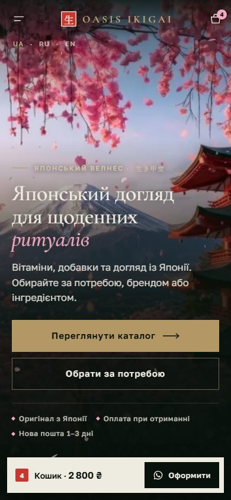
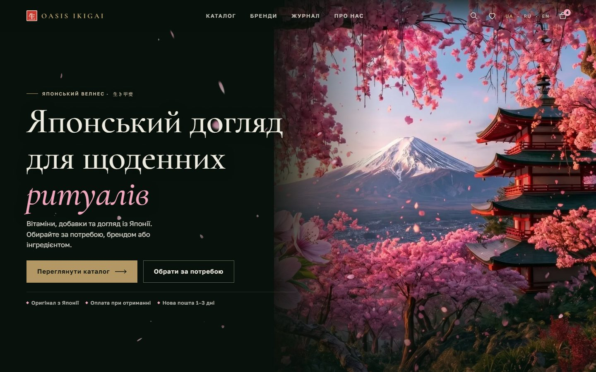
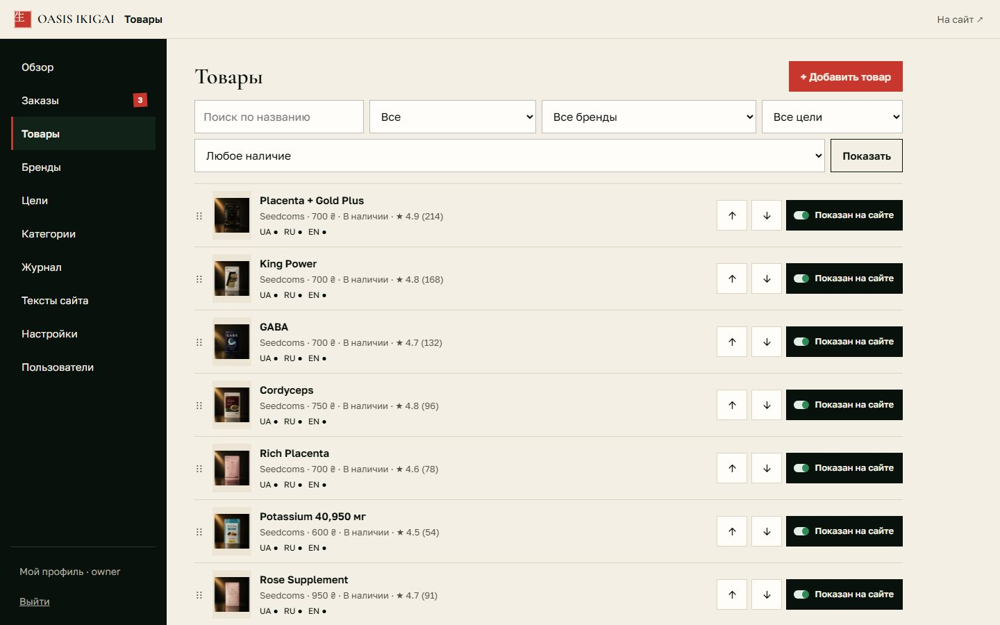
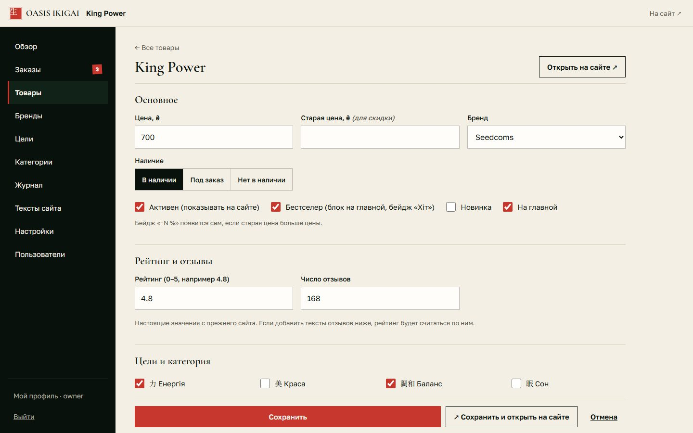
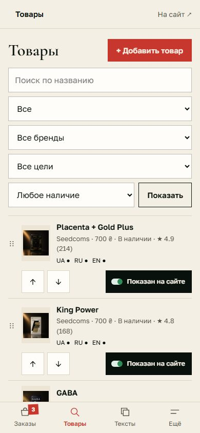
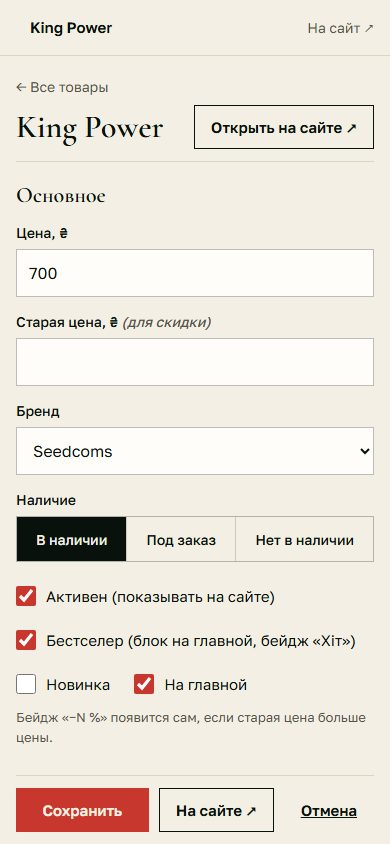

# OASIS IKIGAI — превью сайта

Каталог японских вітамінів, добавок і догляду для України: заказ сохраняется на сайте и уходит менеджеру в WhatsApp, оплата при получении. Три языка: украинский, русский, английский.

**Открыть превью:** https://popoverrr.github.io/oasis-ikigai/
- русская версия: https://popoverrr.github.io/oasis-ikigai/ru/
- английская версия: https://popoverrr.github.io/oasis-ikigai/en/

Смотрите с телефона: сайт сделан в первую очередь под смартфон, на компьютере — раскладка с видео на правой половине экрана.

 

## Что можно посмотреть

- главную: видео с сакурой и лепестки поверх него, плитки 9 целей, бестселлеры, философию, новинки, подбор «Знайдіть своє IKIGAI», бренды, журнал, вопросы;
- каталог: цели, фильтры по бренду, категории, цене и наличию, сортировку, поиск, «Показати ще»;
- 74 товара с рейтингами, 38 брендов, 7 статей журнала;
- страницу товара: галерею, количество, «Обране», быстрый заказ, описание, похожие товары;
- корзину, ссылку на корзину и оформление заказа;
- экран «Замовлення прийнято»;
- страницы «Про нас», «Доставка», «Оплата», «Повернення», «Питання та відповіді», «Контакти», правовые страницы и 404.

## Чем превью отличается от настоящего сайта

Превью — статическая копия витрины для просмотра. Настоящий сайт работает на PHP и MySQL и устанавливается на хостинг Plesk из архива `oasis-ikigai-plesk.zip`.

- **Заказ не отправляется и не сохраняется.** После оформления показывается пример экрана «Замовлення прийнято» с пометкой «превью».
- **Переход в WhatsApp отключён.** На настоящем сайте здесь открывается чат с менеджером.
- **Фильтры каталога** в превью считаются в браузере; на сайте это делает сервер — результат тот же.
- **Админки в превью нет:** она работает только на сервере. Скриншоты ниже.
- **Превью закрыто от поисковиков** (noindex).

## Админка (скриншоты)

Товары: поиск, фильтры по бренду, цели и наличию, порядок стрелками, «Показан на сайте», рейтинг и отметки переводов UA/RU/EN:

Карточка товара: цена, наличие, бренд, флаги «Бестселер», «Новинка», «На главной», рейтинг и отзывы, цели, тексты на трёх языках, фото с телефона:

С телефона — нижние вкладки «Заказы · Товары · Тексты · Ещё», кнопка «Сохранить» всегда внизу:

 
