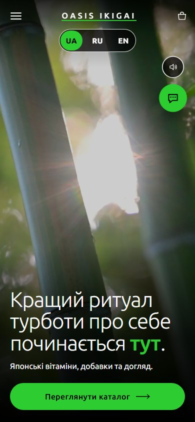
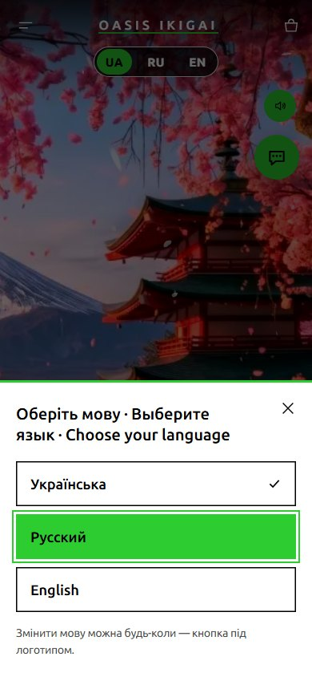
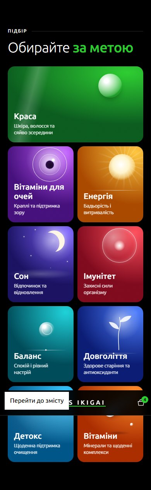
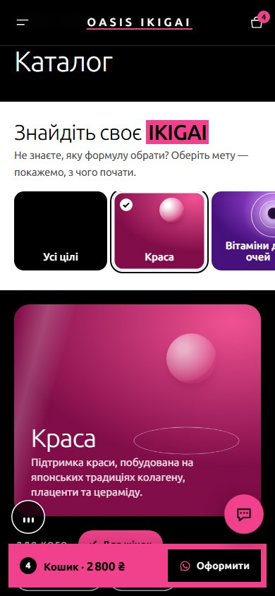
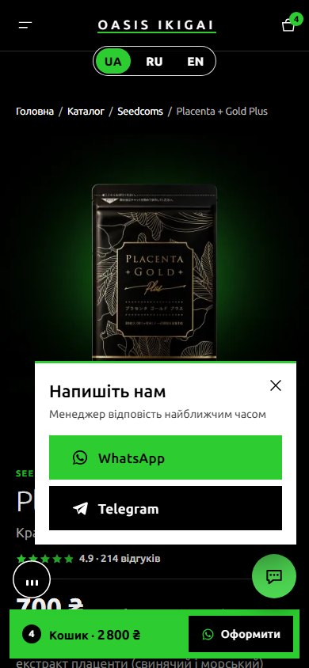
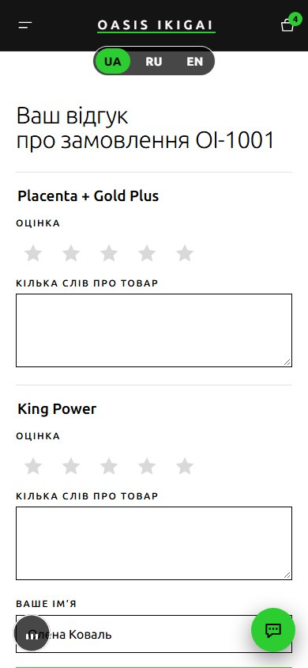
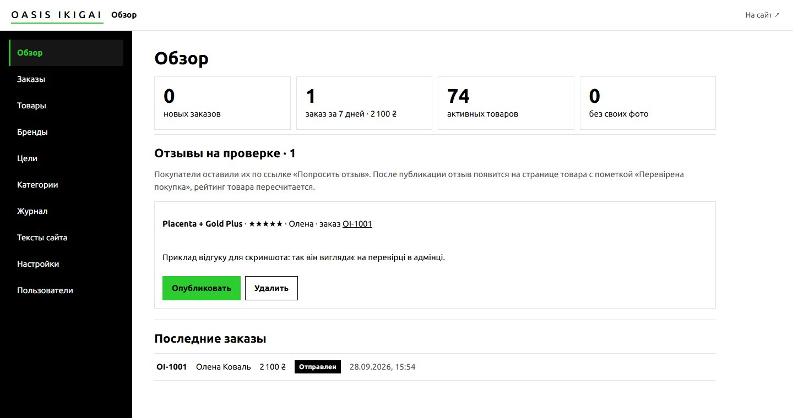
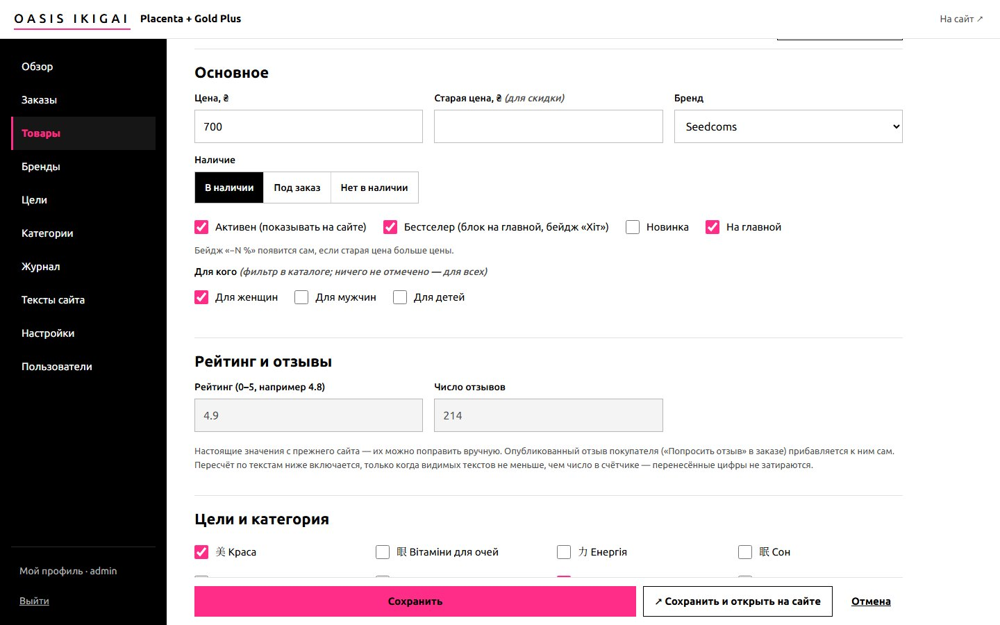
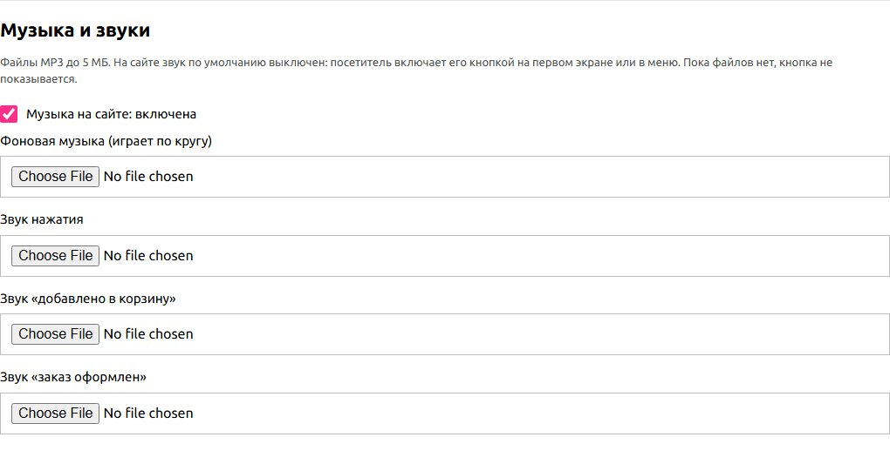
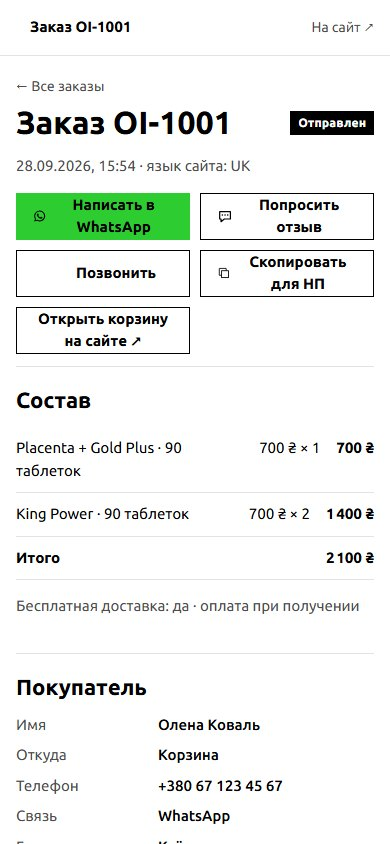

# OASIS IKIGAI — превью сайта

Каталог японских вітамінів, добавок і догляду для України: заказ сохраняется на сайте и уходит менеджеру в WhatsApp, оплата при получении. Три языка: украинский, русский, английский.

**Открыть превью:** https://popoverrr.github.io/oasis-ikigai/
- русская версия: https://popoverrr.github.io/oasis-ikigai/ru/
- английская версия: https://popoverrr.github.io/oasis-ikigai/en/

Смотрите с телефона: сайт сделан в первую очередь под смартфон, на компьютере — раскладка с видео на правой половине экрана.

**Версия v5 — правки руководства (25 пунктов):** главный цвет — яркая сакура `#FF2D87` вместо зелёного, логотип-надпись без знака 生, язык — крупная кнопка под логотипом и выбор языка при первом входе. На телефоне видео на весь первый экран и одна кнопка «Переглянути каталог». Новый порядок главной, новые плитки целей в стиле современной Японии, подбор «Знайдіть своє IKIGAI» и фильтр «Для кого» в каталоге, кнопка чата (WhatsApp и Telegram) на всех страницах, бесплатная доставка от 2 000 ₴.

 

  

## Что можно посмотреть

- главную в новом порядке: видео с сакурой и розовые лепестки → бегущая строка → «Кращий ритуал турботи про себе починається тут.» → бестселлеры → плитки целей → «Мистецтво Ікігаї» → «Чому Японія» с плашкой «Ви замовляєте оригінал, а не підробку» → новинки → бренды бегущей строкой → журнал-карусель → вопросы → футер;
- плитки целей: у каждой свой градиент и спокойная сцена из света и стекла (жемчужина, солнце, месяц, защитная сфера, две сферы, росток, волна, капсула, линза); сцена проявляется при появлении и медленно движется;
- каталог: вверху «Знайдіть своє IKIGAI» — мини-плитки целей («Для очей» второй), фильтр «Для кого» (жінки, чоловіки, діти), бренды, категории, цена, наличие, сортировка, поиск, «Показати ще»; страница цели — с большой плиткой цели над товарами;
- страницу товара: галерею, количество, «Обране», быстрый заказ, «Запитати про товар у чаті», плашку про оригинал, описание, похожие товары;
- кнопку чата справа внизу: «Напишіть нам» с WhatsApp и Telegram;
- корзину с блоком «Як це працює», ссылку на корзину и оформление заказа;
- экран «Замовлення прийнято»;
- 74 товара с рейтингами, 38 брендов, 7 статей журнала, страницы «Про нас», «Доставка», «Оплата», «Повернення», «Питання та відповіді», «Контакти», правовые страницы и 404.

 

## Чем превью отличается от настоящего сайта

Превью — статическая копия витрины для просмотра. Настоящий сайт работает на PHP и MySQL и устанавливается на хостинг Plesk из архива `oasis-ikigai-plesk.zip`.

- **Заказ не отправляется и не сохраняется.** После оформления показывается пример экрана «Замовлення прийнято» с пометкой «превью».
- **Переходы в WhatsApp и Telegram отключены** (Telegram в превью — заглушка). На настоящем сайте здесь открывается чат с менеджером; Telegram появится, когда в настройках будет указан username.
- **Музыки и звуков в превью нет:** на сайте кнопка звука появится, когда в админку загрузят файлы MP3.
- **Страница отзыва** (на скриншоте выше) открывается только по персональной ссылке из заказа, поэтому в превью её нет.
- **Фильтры каталога** в превью считаются в браузере; на сайте это делает сервер — результат тот же.
- **Админки в превью нет:** она работает только на сервере. Скриншоты ниже.
- **Превью закрыто от поисковиков** (noindex).

## Админка (скриншоты)

Обзор: отзывы покупателей на проверке — «Опубликовать» или «Удалить»; опубликованный появится на странице товара с пометкой «Перевірена покупка»:

Карточка товара: цена, наличие, флаги, **«Для кого»** (женщины, мужчины, дети; ничего не отмечено — для всех), рейтинг и отзывы, цели:

Настройки → «Музыка и звуки»: фоновая музыка и три звука интерфейса (MP3 до 5 МБ), выключатель:

С телефона — карточка заказа: после отправки появляется кнопка **«Попросить отзыв»** (WhatsApp покупателя с готовым текстом и ссылкой на отзыв):

